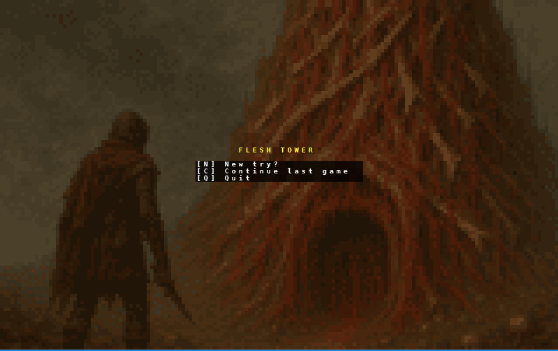

# Readme
This is a little Rouge Like im working on in my free time. The premise is simple,
it's an RPG with mechanics I feel like adding. It currently is a big playground of 
ideas. 

## Premise
The premise is a lone survivor going up a tower built from flesh and viscera.



## Game

The game starts in a small room. The Player by default is a Rouge called `Whisperbound`.
By consuming one of two corpses in the starting room the player permanently switches class to

- **Fighter**: Gorebound
- **Mage**: Helixbound
- **Rouge**: Whisperbound *Default*


The player has a stats panel with various stats.


The player can hover over various things in the world and get a hover over text. Depending on length
its displayed at cursor or one of the corners.


### Classes

The Whisperbound (Rouge) has a stamina bar. This bar allows the player to move
and press shift to "sprint". Now instead of 1 tile the player moves in a two tile
pattern.


The Gorebound (Fighter), has the Mass bar. While consuming various things in the tower
the mass gets accumulated. This mass 


Gaining a mass level influences max HP by a mod of Mass_Level * 4 and
damage_reduction =+ Mass_Level

```python
self.max_hp += self.mass_level * 4
self.damage_reduction += self.mass_level
```

The Helixbound (Mage), gains mana. This mana can be spent by casting spells. The mage
starts with no spells but can by consuming spell scrolls learn them and use them permanently.
(These values for learning need tweaking and don't feal good at this moment.)


